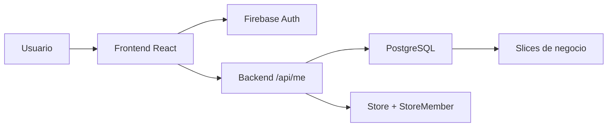

# iManager ? Architecture Decisions (2026-04-02)

Este documento captura la estructura actual del sistema y las decisiones de dise?o tomadas hoy.
Sirve como contexto r?pido para futuros agentes y para entender por qu? el producto qued? armado de esta forma.

## 1) Arquitectura actual

### Capas principales

- **Frontend**: React + Vite + TypeScript.
- **Auth**: Firebase Auth sigue siendo el proveedor de identidad.
- **Backend**: servicio propio en Railway (`backend/`) con Fastify + Prisma + Firebase Admin.
- **Base de datos**: PostgreSQL en Railway como fuente de verdad del negocio.
- **Integraci?n de sesi?n**: `/api/me` resuelve usuario, tienda y membres?a de app.

### Flujo general

## 2) Decisiones de dise?o tomadas hoy

### 2.1 Firebase Auth se mantiene

- Se decidi? **no migrar a Clerk** todav?a.
- Raz?n: el problema real del proyecto no era el proveedor de auth, sino la falta de backend + Postgres + contexto de negocio.
- Tradeoff: menos esfuerzo hoy, m?s velocidad para estabilizar el core.

### 2.2 Postgres es la fuente de verdad del negocio

- Firebase Auth queda para identidad.
- El negocio real vive en Postgres.
- Evitamos dual-write permanente entre Firestore y Postgres.
- Tradeoff: la migraci?n requiere disciplina, pero reduce inconsistencias a largo plazo.

### 2.3 Backend obligatorio para m?dulos migrados

- `clients`, `inventory`, `sales` y `trade-ins` ya tienen backend real.
- En m?dulos migrados, no se debe fingir persistencia con fallbacks silenciosos.
- Si el backend est? configurado y falla, el usuario debe ver un error real.
- Tradeoff: menos ?magia? en la UI, m?s verdad operativa.

### 2.4 Onboarding real para usuarios sin tienda/membres?a

- Ya no se asume que crear una cuenta en Firebase alcanza.
- Si `/api/me` devuelve `onboardingRequired`, la app muestra onboarding.
- El onboarding crea `Store` + `StoreMember` OWNER.
- Tradeoff: un paso extra para el usuario, pero contexto de negocio correcto.

### 2.5 No m?s ?xito fantasma en inventario

- Inventario ten?a el peor patr?n posible: guardar visualmente, recargar y perder datos.
- Se elimin? el fallback silencioso a Firestore cuando backend est? activo.
- Ahora inventario escribe por backend o falla con error visible.
- Tradeoff: el tester ve errores reales, pero el sistema deja de mentir.

### 2.6 Documentaci?n viva obligatoria

- `PROJECT_STATUS.md` es el estado vivo.
- `AGENTS.md` es handoff operativo.
- Este archivo concentra decisiones de dise?o del d?a.
- Tradeoff: m?s documentaci?n, pero menos contexto perdido entre agentes.

## 3) Estructura funcional del producto

### Autenticaci?n y sesi?n

1. Usuario entra con Firebase Auth.
2. Frontend obtiene token.
3. Backend valida token y resuelve usuario interno.
4. Si no hay tienda/membres?a, devuelve onboarding requerido.
5. Si hay contexto de negocio, la app entra al core.

### Onboarding

- Captura nombre de tienda.
- Crea `Store`.
- Crea `StoreMember` OWNER.
- Refresca sesi?n.
- Desbloquea el core.

### Dominio migrado

- `clients`: CRUD real en backend.
- `inventory`: CRUD real en backend, con unicidad por `storeId + imei`.
- `sales`: transaccional; muta inventario y totales del cliente.
- `trade-ins`: CRUD real en backend, filtrado por `storeId`.

## 4) Reglas que NO conviene romper

- No hacer build despu?s de cambios.
- No usar fallback silencioso en m?dulos ya migrados.
- No mezclar Firestore y Postgres como fuentes activas del mismo dato.
- No asumir que un usuario autenticado ya tiene contexto de negocio.
- No dejar modales cerrarse como si todo sali? bien si la persistencia real fall?.

## 5) Tradeoffs que aceptamos hoy

- Firebase Auth sigue por pragmatismo, no por pureza arquitect?nica.
- Algunos m?dulos a?n conservan fallback o compatibilidad parcial mientras la migraci?n se estabiliza.
- El onboarding agrega fricci?n inicial, pero evita errores de membres?a y estados intermedios t?xicos.

## 6) Qu? qued? probado hoy

- Login con Google y email/password.
- `/api/me` como puente de sesi?n.
- Bootstrap inicial de tienda/membres?a.
- Onboarding para usuarios nuevos.
- Fix de persistencia fantasma en inventario.
- Persistencia real del core en Postgres para los m?dulos migrados.

## 7) Qu? sigue pendiente

- Rehacer dashboard y reportes sobre SQL real.
- Centralizar audit logs.
- Revisar settings e integraciones.
- Seguir endureciendo formularios secundarios y estados de borde.
- Probar todo el core con datos reales y no con n?meros demo.

## 8) Estructura de archivos relevante

- `backend/` ? backend propio con API, Prisma, scripts y onboarding.
- `src/context/AppContext.tsx` ? bridge principal de sesi?n/CRUD del frontend.
- `src/services/*.ts` ? clientes HTTP hacia backend.
- `PROJECT_STATUS.md` ? estado vivo y checklist.
- `AGENTS.md` ? handoff entre agentes.

## 9) Resumen ejecutivo

La arquitectura actual tom? una direcci?n clara:

- identidad en Firebase,
- negocio en Postgres,
- backend propio como puerta de entrada obligatoria,
- onboarding como mecanismo para completar contexto,
- y nada de persistencia fantasma en m?dulos ya migrados.

Eso deja el sistema mucho m?s honesto y mucho m?s apto para el primer tester.
