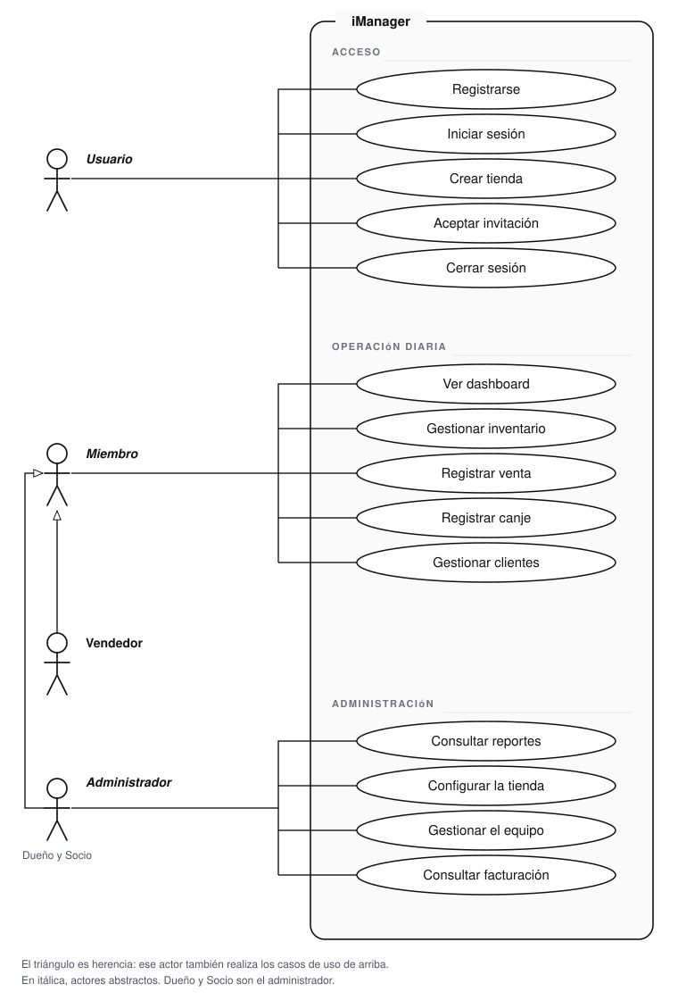

# iManager

Panel de gestión POS para tiendas de celulares/dispositivos.

---

## Qué es

iManager es una app de gestión para tiendas de celulares. Maneja:

- Inventario por IMEI (condición, batería, categorías, columnas custom)
- Ventas (transaccional: muta stock y totales del cliente)
- Clientes con historial de compras
- Canjes / trade-ins
- Import de inventario desde CSV/XLSX
- Auth multi-proveedor (Google + email/password)

---

## Casos de uso



El usuario se registra, inicia sesión, crea su tienda o acepta una invitación. El vendedor opera el día a día: dashboard, inventario, ventas, canjes y clientes. Dueño y Socio hacen esa misma operación y, además, consultan reportes, configuran la tienda, gestionan el equipo y ven facturación.

---

## Stack

| Capa | Tecnología |
|------|-----------|
| Frontend | React 19 + Vite + TypeScript + Tailwind CSS 4 |
| Backend | Fastify + Prisma + Firebase Admin (Railway) |
| Base de datos | PostgreSQL en Railway |
| Auth | Firebase Authentication |
| Deploy | Railway (proyecto `efficient-magic`) |

---

## Estado actual (2026-04-04)

Los módulos core (inventory, clients, sales, trade-ins) están en producción sobre PostgreSQL.
Dashboard, Reports, Notifications y Settings siguen siendo demo/placeholder.

Ver `PROJECT_STATUS.md` para el estado detallado y el roadmap.

---

## Cómo correr el proyecto

```bash
# Frontend
npm install
npm run dev       # http://localhost:5173
npm run lint      # tsc --noEmit

# Backend (desde backend/)
npm install
npm run dev       # tsx watch src/server.ts
npm run lint
npx prisma studio # UI de PostgreSQL
```

### Variables de entorno

**Frontend (`.env.local`):**
```
VITE_BACKEND_URL=http://localhost:3001
VITE_FIREBASE_API_KEY=...
VITE_FIREBASE_AUTH_DOMAIN=...
VITE_FIREBASE_PROJECT_ID=...
VITE_FIREBASE_APP_ID=...
```

**Backend (`backend/.env`):**
```
DATABASE_URL=postgresql://...
FIREBASE_PROJECT_ID=...
FIREBASE_CLIENT_EMAIL=...
FIREBASE_PRIVATE_KEY=...
FIRESTORE_DATABASE_ID=...
```

---

## Flujo de sesión

```
Firebase Auth → JWT → /api/me → User + Store + StoreMember
  ↓ onboardingRequired?
  Sí → pantalla de onboarding → crea Store + StoreMember OWNER
  No → app core
```

---

## Documentación para agentes AI

Si sos un agente empezando a trabajar en este repo:

1. **`AGENTS.md`** — onboarding completo: stack, módulos, reglas, skills
2. **`PROJECT_STATUS.md`** — estado vivo, roadmap, issues conocidos
3. **`.agent/skills/`** — skills por área (frontend, backend, inventory)

---

## Reglas clave

- No hacer build manual (Railway hace el build en deploy)
- Los módulos migrados no usan fallback silencioso a Firestore
- Backend propio es obligatorio para toda lógica de negocio
- Un usuario autenticado puede necesitar onboarding antes de usar el core
